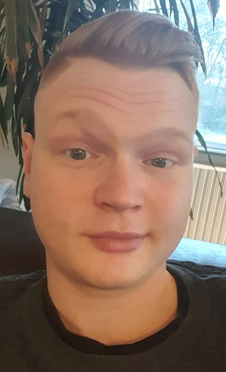

<!DOCTYPE html>
<html lang="dk">

<head>
    <title>Home</title>
    <meta charset="utf-8">
    <meta name="viewport" content="width=device-width, initial-scale=1">
    <link href="https://cdn.jsdelivr.net/npm/bootstrap@5.1.3/dist/css/bootstrap.min.css" rel="stylesheet">
    
    
</head>

<body>
    <!-- Page name banner -->
    

        <h1 class="display-1">Hvem er jeg?</h1>

        <h6>Her får du lidt informationer om hvem jeg er og hvad jeg kan</h6>
    

    <!--Black banner-->
    

        <h6 class="display-6"></h6>
    

    <!--Container with navigation and information-->

    

        

            <!--Navigation-->
            

                
                <ul class="nav nav-pills flex-column">
                    <li class="nav-item btn btn-dark btn-block mt-2">
                        

                            <a role="button" class="btn btn-dark btn-block" href="../Pages/index.html">
                                Home
                            </a>
                        

                    </li>
                    

                    <li class="nav-item dropdown btn btn-dark mt-2">
                        <a class="nav-link text-white dropdown-toggle" data-bs-toggle="dropdown" href="#">Portfolio</a>
                        <ul type="button" class="dropdown-menu">
                            <li><a class="dropdown-item text-center" href="../Pages/Gallerier.html">Gallerier</a></li>
                            <li><a class="dropdown-item text-center" href="../Pages/ASCII ART.html">ASCII Art</a></li>
                            <li><a class="dropdown-item text-center" href="../Pages/Planter.html">Planter</a></li>

                        </ul>
                    </li>
                    

                    <li class="nav-item btn btn-dark btn-block mt-2">
                        

                            <a role="button" class="btn btn-dark btn-block" href="../Pages/Kontakt.html">
                                Kontakt
                            </a>
                        

                    </li>
                </ul>
                

            

            <!--Leftside of text-->
            

                <h5 class="text-info text-center fst-italic lh-base">Hvem jeg er og hvorfor programmering</h5>
                

                    

                        Mit navn er Michael, jeg er 27 år, bor i Ballerup og er i gang med at uddanne mig til
                        datatekniker med speciale i programmering,
                        så derfor er jeg igang med skoleoplæringscentret, det hed førhen skolepraktikcentret, grunden
                        til navneskiftet er fordi vi som har genneført grundforløb 2 leder efter en læreplads og ikke en
                        praktik plads,
                        da vi er klar til at starte med det samme, og fordi en læreplads er med løn hvorimod at en
                        praktikplads er ulønnet og kun er en kort periode.
                    

                    

                        

                            

                                Jeg har valgt denne uddannelse da elektronik og teknologier altid har været en stor
                                interresse,
                                da jeg var lille havde vi en playstation 1 som mig, min far og onkel sad og spillede på,
                                jeg fik kontolleren hvis der var noget der ikke var helt nemt for de gamle,
                                og tit og ofte fik jeg klaret det, når jeg tænker på de tider hvor vi sad ved
                                playstationen får jeg en lyst til at lave et spil som kan samle familien på samme måde
                            

                        

                        

                            

                                

                                    Jeg er rigtig glad for spil og vil gerne lave mine egne spil på et tidspunkt,
                                    og så synes jeg at AI-teknologi lyder som et interessant område, det kan jeg
                                    bruge til spil og andre mange andre ting,
                                    jeg er også interresseret i betalingssystemer både til spil, butikker og online
                                    webshops da jeg har en EUD business(grundforløb) efter et arbejde i Elgiganten
                                

                            

                        

                    

                

            

            <!--Middle of text-->
            

                <h5 class="text-info text-center fst-italic lh-base">Interesser</h5>
                

                    

                        Når jeg vil sidde ved min pc så kan jeg godt lide at lave mange forskellige ting det kan være at
                        spille med vennerne, eller lave figurer i et program der hedder blender,
                        jeg er godt nok ikke super god til det, men øvelse gør mester som man siger,
                        og så er jeg så heldig at man kan finde mange guides på youtube og google,
                        hvor der sidder nogle virkelige dygtige artister,
                        det samme samme gælder for Unity, der har jeg også set nogle guides på hvordan man bruger det
                        program, men jeg har et lille problem og det er der hvor blender kommer ind i billedet,
                        jeg er ikke særlig god til at bruge de assets der er i Unity storen så derfor prøver jeg at lave
                        mine egene assets til spil, jeg har en drøm om at lave spil som folk vil spille og som de kan lide.
                    

                

                

                    

                        
Når årstiderne er til det, så bliver der plantet
                            forskellige slags planter, i år er det basilikum og oregano.

                        

                            Når min ryg er klar igen så er der også noget fitness på menu`en.
                        

                    

                

            

            <!--Rightside of text-->
            

                <h5 class="text-info text-center fst-italic lh-base">Skole og erhverserfaring</h5>
                

                    
* Tankmedarbejder

                    
* 9/10. klasse

                    
* Selvstændig i biograf

                    
* Flyttemand hos RTC

                    
* Café medarbejder

                    
* knowhow support Elgiganten

                    
* Vikar hos Hartmanss

                

                

                    

                        
* Mine fritids interesser er Gaming, venner, familie og fitness.
                            Jeg har arbejdet som support i knowhow Taastrup i 2 år.
                        

                        
* Efter et næsten færdigt grundforløb som smed har jeg et
                            amu-kursus i arbejdsmiljø og sikkerhed svejsning/termisk #44530

                    

                

            

        

    

    <!--Black banner-->
    

        <h6 class="display-6"></h6>
    

    

</body>
